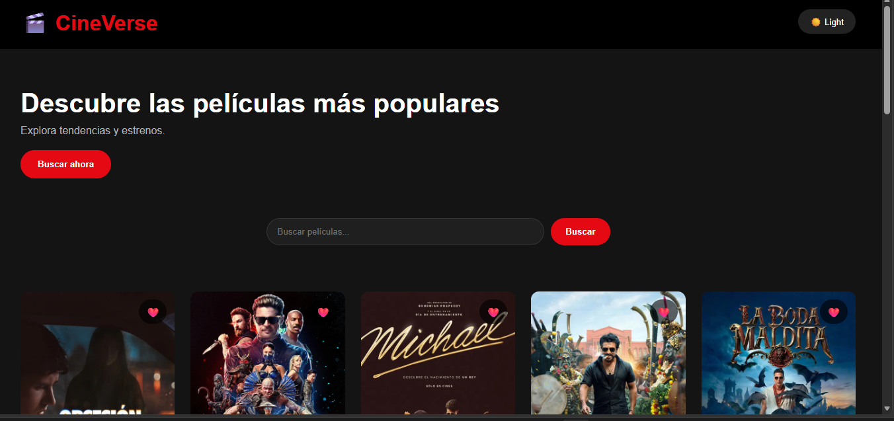
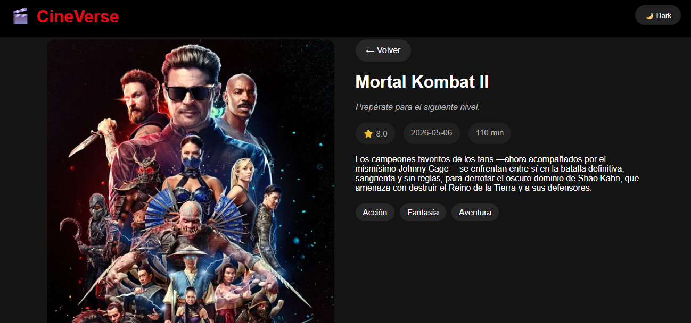
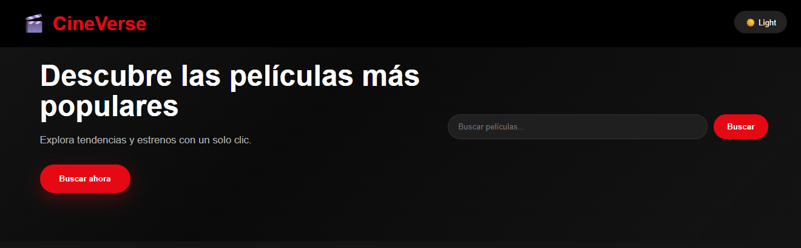

# 🎬 CineVerse

<p align="center">
  <strong>Explora las películas más populares del momento con una interfaz moderna desarrollada en React.</strong>
</p>

<p align="center">


</p>

---

## 📖 Descripción

**CineVerse** es una aplicación web desarrollada con **React + Vite** que consume la API de **The Movie Database (TMDB)** para mostrar las películas más populares en tiempo real.

Este proyecto forma parte de mi portafolio como egresada de **Licenciatura en Sistemas Computacionales**, con el objetivo de fortalecer mis habilidades en desarrollo Frontend utilizando React, consumo de APIs REST y creación de interfaces modernas y responsivas.

---

# 📸 Vista previa

## Inicio



---

## Tarjetas de películas



---

## Responsive



---

## ✨ Funcionalidades

- 🎬 Consulta de películas populares.
- ⭐ Visualización de calificaciones.
- 🖼️ Pósters en alta calidad.
- ⚛️ Arquitectura basada en componentes.
- 🔄 Consumo de API REST.
- 📱 Diseño responsive.
- 🧭 Navegación con React Router.

---

# 🛠️ Tecnologías

- React
- Vite
- JavaScript ES6+
- HTML5
- CSS3
- React Router DOM
- TMDB API

---

# 📂 Estructura

```text
src/
│
├── components/
│   ├── MovieCard.jsx
│   ├── MovieGrid.jsx
│   └── Navbar.jsx
│
├── pages/
│   ├── Home.jsx
│   └── Details.jsx
│
├── services/
│   └── api.js
│
├── App.jsx
├── main.jsx
└── index.css
```

---

# 🚀 Instalación

```bash
git clone https://github.com/arlethC12/cineverse.git

cd cineverse

npm install

npm run dev
```

---

# 🔑 Variables de entorno

Crear un archivo `.env` en la raíz del proyecto:

```env
VITE_TMDB_API_KEY=TU_API_KEY
```

Obtén una API Key gratuita en:

https://www.themoviedb.org/

---

# 🚧 Próximas mejoras

- 🔍 Búsqueda de películas.
- 🎞️ Página de detalles.
- ❤️ Favoritos con LocalStorage.
- 🌙 Tema oscuro.
- 🎬 Tráileres.
- 👥 Reparto principal.
- 🎥 Películas similares.
- 📄 Paginación.

---

# 👩‍💻 Autora

**Arleth Guadalupe Castro Martínez**

Egresada de la Licenciatura en Sistemas Computacionales.

Actualmente fortaleciendo mis habilidades en **React**, JavaScript y desarrollo Frontend para incorporarme como **Desarrolladora Web Junior**.

### Contacto

- GitHub: https://github.com/arlethC12
- LinkedIn: https://www.linkedin.com/in/arleth-guadalupe-castro-martinez-49026638a

---

# 📄 Licencia

Proyecto desarrollado como parte de mi portafolio profesional.